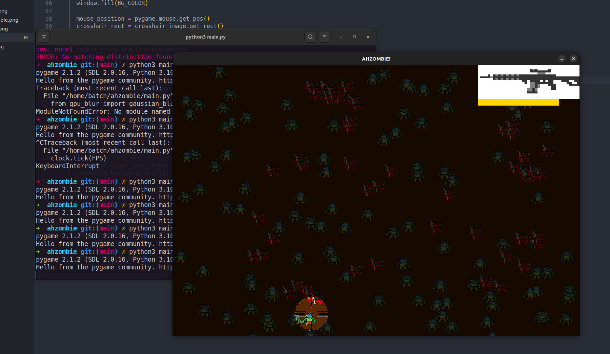
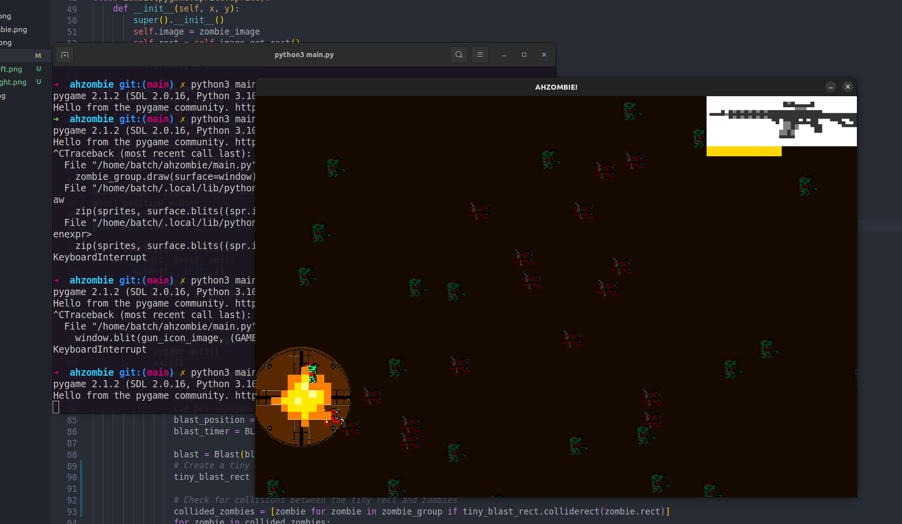

# AHZOMBIE!

AHZOMBIE! is a simple 2D zombie shooting game built with pygame.
The game features a top-down perspective where players must 
eliminate zombies as a sniper using a gun with limited ammo.

## How to Play

- Move the crosshair using the mouse to aim at the zombies.
- Left-click to shoot the zombies. You will have to reload.
The reloading progress is displayed as a red bar below the gun 
icon at the top-right corner of the screen. Magazine capacity 
is the yellow bar present when reloading is complete. 
- Kill as many zombies as you can!

# Features
- reloading and magazine capacity
- zombies sprite change when killed
- bullet holes (with adjustable max)
- cool gunshot audio (with mutli-channel audio layering)

